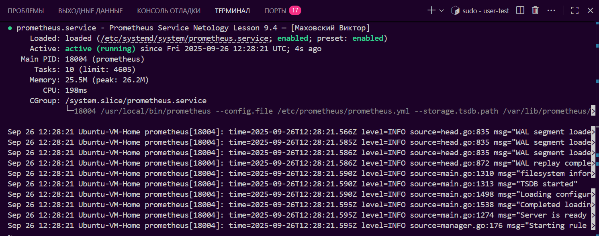
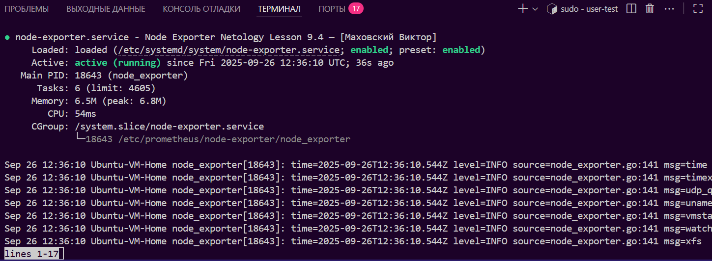
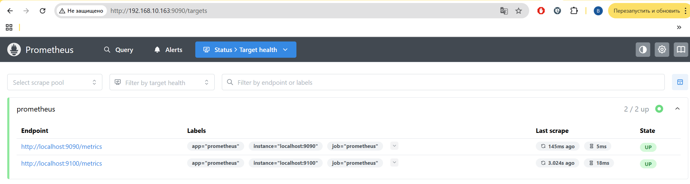
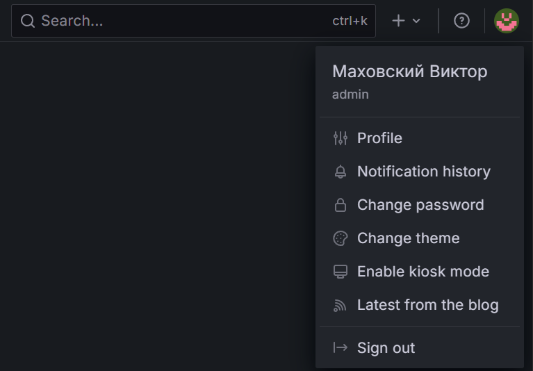

# Домашнее задание к занятию "`Домашняя работа 9-4`" - `Маховского Виктора`

---

### Задание 1

1. `Проверяем статус Prometheus`
```
sudo systemctl status prometheus
```


---

### Задание 2

1. `Проверяем статус Node Exporter`
```
sudo systemctl status node-exporter.service
```


---

### Задание 3

1. `Prometheus вкладки Status > Configuration`


2. `Prometheus вкладки Status > Targets`



---

### Задание 4

1. `Интерфейс Grafana`


